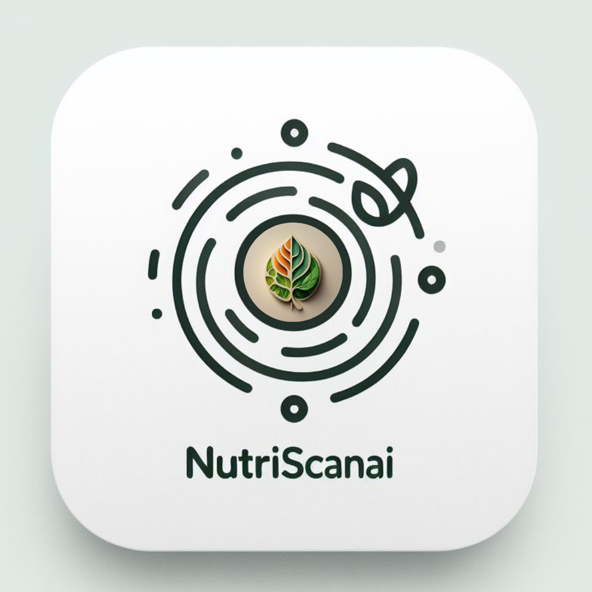
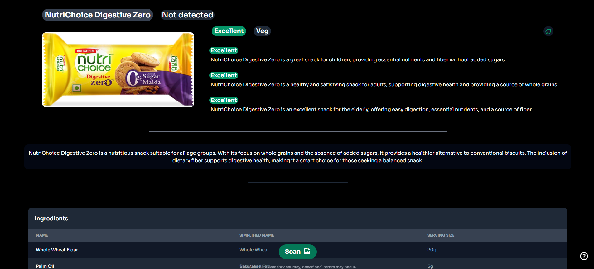

# NutriScanAI 🥗🔍

## Scan Smart, Eat Smart 🌱🧠

### Revolutionizing nutrition analysis. Effortlessly decode food labels for expert-level insights, empowering informed, health-conscious choices. 🚀🍏

An application for analyzing images containing food or body care product information and providing comprehensive nutritional and product details in real-time.

## Preview

## Features 🌟

- **Real-time Analysis**: Analyze images instantly upon upload. 📸🕒
- **Image Classification**: Identify if the image depicts a food package or body care product. 🖼️🔖
- **Ingredient Information Extraction**: Extract ingredients list from packaging. 🥦📋
- **Nutritional Information**: Provide accurate nutritional information based on extracted text and independent research. 📊🥗
- **Product Description**: Generate detailed descriptions of products based on analysis. 📝📦
- **Age-Group Specific Analysis**: Categorize products' suitability for different age groups. 👶👩👴
- **Error Handling**: Gracefully handle errors and provide helpful error messages. ❌🛠️
- **Sustainability Assessment**: Evaluate the sustainability practices of the company manufacturing the product. 🌍🌿

## Technologies Used 🛠️

- **Node.js**: Backend runtime environment.
- **Express.js**: Web application framework for Node.js.
- **Socket.IO**: Real-time communication library.
- **Google Generative AI**: Utilized for image analysis.
- **EJS**: Embedded JavaScript templates for rendering HTML.

## Usage 🥦

1. Upload an image containing food or body care product information.
2. Wait for the analysis to complete.
3. View detailed nutritional and product information.

---

🌱 **Start making informed, health-conscious choices with NutriScanAI!** 🍎🧠